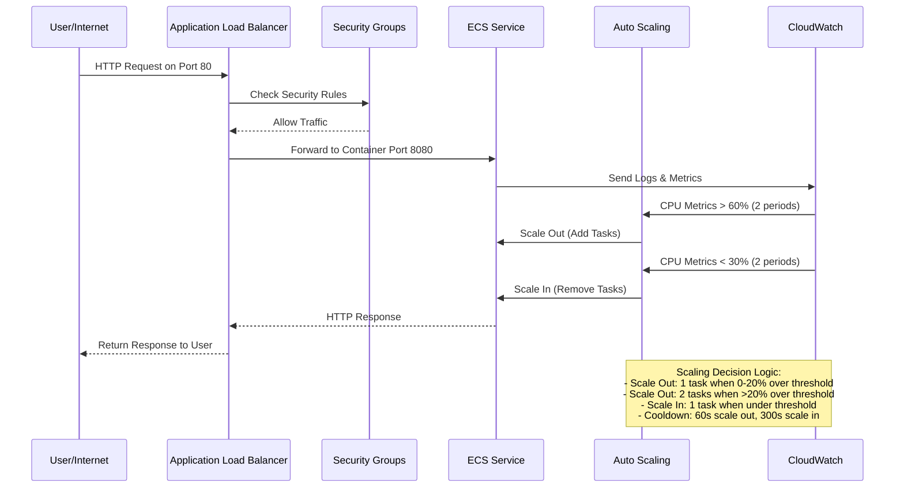
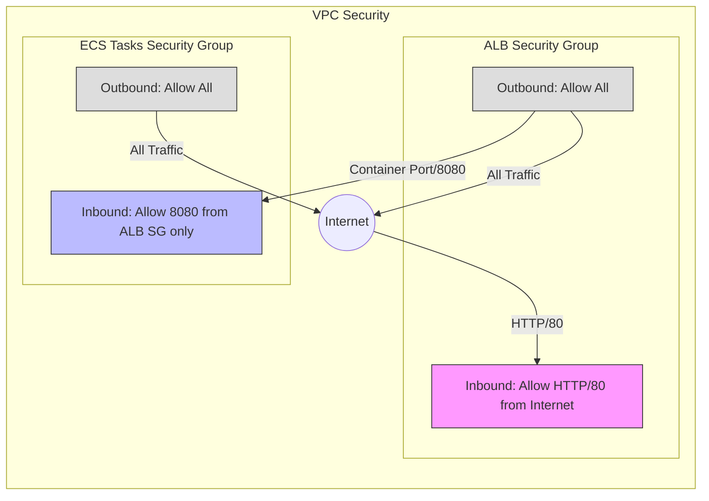

# Modular AWS ECS Service with ALB

This Terraform project creates an ECS service exposed via an Application Load Balancer (ALB) with auto-scaling capabilities. The configuration is organized in a modular way to improve maintainability, reusability, and separation of concerns.

## Architecture

The project creates the following infrastructure:

- VPC with public and private subnets across multiple availability zones
- Internet Gateway and NAT Gateway for network connectivity
- Application Load Balancer (ALB) for HTTP traffic
- ECS Cluster with Fargate launch type
- ECS Service with Auto Scaling based on CPU utilization
- Security groups, IAM roles, and policies with least privilege principles
- CloudWatch log groups and alarms for monitoring

### Architecture Diagram

```mermaid
graph TD
    subgraph "AWS Cloud"
        subgraph "VPC" 
            subgraph "Public Subnets"
                ALB[Application Load Balancer]
                IG[Internet Gateway]
                NAT[NAT Gateway]
            end
            
            subgraph "Private Subnets"
                subgraph "ECS Cluster"
                    ECS_Service[ECS Service]
                    subgraph "Auto Scaling"
                        ECS_Task1[ECS Task]
                        ECS_Task2[ECS Task]
                        ECS_Task3[ECS Task]
                    end
                end
            end
        end
        
        Internet((Internet))
        CW[CloudWatch Logs]
        CW_Alarm[CloudWatch Alarms]
        
        IAM_Roles[IAM Roles]
    end
    
    Internet -- HTTP:80 --> ALB
    ALB -- HTTP:8080 --> ECS_Service
    ECS_Service --> ECS_Task1 & ECS_Task2 & ECS_Task3
    ECS_Task1 & ECS_Task2 & ECS_Task3 -- Logs --> CW
    CW_Alarm -- "Trigger Scale In/Out" --> ECS_Service
    
    Internet -- HTTP --> IG
    IG --> ALB
    Private Subnets --> NAT
    NAT --> Internet
    
    IAM_Roles -- "Permissions" --> ECS_Service
    
    style ALB fill:#f9f,stroke:#333,stroke-width:2px
    style ECS_Service fill:#bbf,stroke:#333,stroke-width:2px
    style ECS_Task1 fill:#bfb,stroke:#333,stroke-width:1px
    style ECS_Task2 fill:#bfb,stroke:#333,stroke-width:1px,stroke-dasharray: 5 5
    style ECS_Task3 fill:#bfb,stroke:#333,stroke-width:1px,stroke-dasharray: 5 5
    style CW_Alarm fill:#ffb,stroke:#333,stroke-width:1px
    
    classDef subnet fill:#eff,stroke:#099,stroke-width:1px,stroke-dasharray: 5 5
    class "Public Subnets","Private Subnets" subnet
```

## Resource Communication Flow



## Security Group Rules Visualization



## Module Dependency Diagram

```mermaid
graph TD
    Root[Root Module]
    Network[Network Module]
    Security[Security Module]
    ALB[ALB Module]
    ECS[ECS Module]
    
    Root --> Network
    Root --> Security
    Root --> ALB
    Root --> ECS
    
    Security -.->|vpc_id| Network
    ALB -.->|vpc_id<br/>public_subnet_ids| Network
    ALB -.->|alb_security_group_id| Security
    
    ECS -.->|vpc_id<br/>private_subnet_ids| Network
    ECS -.->|ecs_tasks_security_group_id<br/>task_execution_role_arn<br/>task_role_arn| Security
    ECS -.->|target_group_arn| ALB
    
    classDef module fill:#f9f,stroke:#333,stroke-width:2px
    class Root,Network,Security,ALB,ECS module
    
    classDef dependency stroke-dasharray: 5 5,stroke:#333,stroke-width:1px
    class "Security -.->|vpc_id| Network","ALB -.->|vpc_id<br/>public_subnet_ids| Network","ALB -.->|alb_security_group_id| Security","ECS -.->|vpc_id<br/>private_subnet_ids| Network","ECS -.->|ecs_tasks_security_group_id<br/>task_execution_role_arn<br/>task_role_arn| Security","ECS -.->|target_group_arn| ALB" dependency
```

## Module Structure

The project is divided into the following modules:

1. **Network Module** (`./modules/network/`)
   - VPC, subnets, gateways, route tables
   - Handles the networking foundation

2. **Security Module** (`./modules/security/`)
   - Security groups for ALB and ECS tasks
   - IAM roles for task execution and task roles
   - Implements security best practices

3. **ALB Module** (`./modules/alb/`)
   - Application Load Balancer
   - Target groups and listeners
   - Health checks configuration

4. **ECS Module** (`./modules/ecs/`)
   - ECS cluster and service
   - Task definition and container configuration
   - Auto-scaling configuration and alarms
   - CloudWatch logs

## Usage

1. Initialize Terraform:
```bash
terraform init
```

2. Review the plan:
```bash
terraform plan
```

3. Apply the configuration:
```bash
terraform apply
```

4. To destroy the resources:
```bash
terraform destroy
```

## Customization

The project can be customized by modifying the values in `terraform.tfvars` or by passing variables at runtime.

## Outputs

The main outputs include:
- ALB DNS name for accessing the service
- ECS cluster and service names
- VPC and subnet IDs for reference

## Auto Scaling Configuration

The ECS service is configured with auto scaling capabilities to handle varying loads:

### Auto Scaling Configuration Details

- **Scaling Type**: Step scaling policy for more granular control
- **Metric**: CPU utilization (ECS Service Level)
- **Scale Out (Add Capacity)**:
  - **Threshold**: ≥ 60% CPU utilization
  - **Evaluation Periods**: 2 consecutive periods
  - **Period Duration**: 60 seconds
  - **Steps**:
    - 0-20% above threshold: Add 1 task
    - >20% above threshold: Add 2 tasks
  - **Cooldown**: 60 seconds between scale-out events

- **Scale In (Remove Capacity)**:
  - **Threshold**: ≤ 30% CPU utilization 
  - **Evaluation Periods**: 2 consecutive periods
  - **Period Duration**: 60 seconds
  - **Action**: Remove 1 task
  - **Cooldown**: 300 seconds between scale-in events (longer to prevent thrashing)

- **Capacity Constraints**:
  - **Minimum**: 1 task
  - **Maximum**: 3 tasks
  - **Desired**: 1 task (baseline)

- **Deployment Configuration**:
  - **Circuit Breaker**: Enabled with automatic rollback
  - **Maximum Percent**: 200% (allows double capacity during deployments)
  - **Minimum Healthy Percent**: 50% (ensures at least half of tasks remain available)

## Requirements

- Terraform >= 1.0.0
- AWS provider ~> 5.0
- AWS CLI configured with appropriate credentials

## Notes

- The backend configuration uses an S3 bucket for state storage
- State locking is implemented using DynamoDB